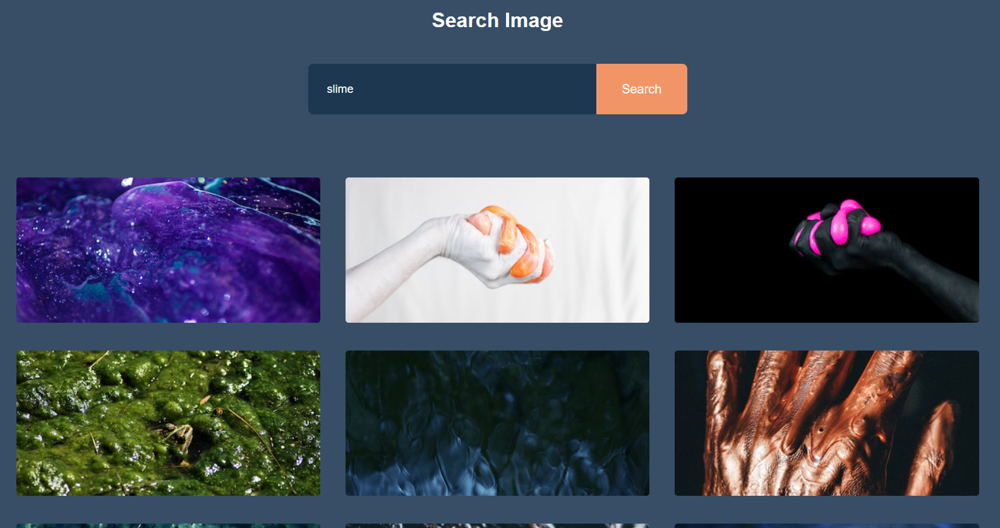

## Image Search App

This app uses the Unsplash api to create an image search engine. It takes a user input and outputs results best matching the search. It has the option to show more images and it links to unsplash photos on each image.

   

## Use

Users must enter what they seek to retrieve images of. The app then return results which best matches their search. The app uses css to display the images into a 3x3 grid and is also responsive.  